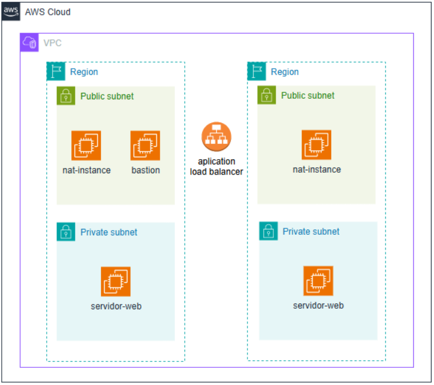

# Documentação do Projeto Terraform: VPC, Subnet Pública e Instância EC2

## 1. Introdução  
Este projeto utiliza o Terraform para provisionar recursos na AWS. Ele cria uma infraestrutura para hospedar um site estático em uma instância EC2 dentro de uma VPC.

## 2. Requisitos  
Antes de começar, certifique-se de ter as seguintes ferramentas e recursos disponíveis:
- Terraform
- Conta AWS válida com credenciais configuradas localmente

## 3. Descrição dos Arquivos  
- **main.tf**: Define os recursos da AWS a serem provisionados.
- **network.tf**: Define a configuração da rede, incluindo VPC, subnets e grupos de segurança.
- **variables.tf**: Faz as descrições das variáveis utilizadas no projeto; Script para a configuração da instância EC2.
- **variables.auto.tfvars**: Declara as variáveis utilizadas no projeto.
- **ami.tf**: Define a AMI (Amazon Machine Image) da instância EC2.
- **chave-ec2.tf**: Resgata a chave-par que será associada à instância EC2.
- **aplicacao.tf**: Cria a instância EC2 com o sistema operacional Ubuntu, usada para o servidor.
- **nat-instance.tf**: Cria a instância EC2 com o sistema operacional Amazon-linux, usada com NAT-instance.
- **bastion.tf**: Cria a instância EC2 com o sistema operacional Ubuntu, para acesso das aplicações.
- **aplication-loadbalancer.tf**: Cria um ALB para as instâncias EC2 usadas para o servidor.

## 4. Configuração  
Antes de iniciar, ajuste as variáveis necessárias no arquivo `variables.tf` e `variables.auto.trvars` e configure suas credenciais AWS utilizando o comando `aws configure`.

## 5. Execução  
1. Navegue até o diretório do projeto no terminal.
2. Execute `terraform init` para inicializar o diretório.
3. Execute `terraform plan` para visualizar as mudanças planejadas.
4. Execute `terraform apply` para aplicar as mudanças e criar os recursos na AWS.

## 6. Recursos Criados  
- **VPC**: Uma VPC com configurações padrão.
- **Subnets Públicas**: Duas subnets pública dentro da VPC.
- **Subnets Privadas**: Duas subnets privadas dentro da VPC.
- **Instâncias EC2**: Duas instâncias EC2 com o site estático hospedado, duas instâncias para o NAT e uma para o bastion.
- **Load Balancer**: Um load balancer.
- **Grupos de Segurança, Rotas e IGW**: Grupos de segurança, rotas e um internet gateway (IGW).

## 7. Acesso ao Site  
Após a conclusão da implantação, você pode acessar o site através do endpoint do Load Balancer.

## 8. Limpeza  
Para evitar custos desnecessários, execute `terraform destroy` após a conclusão do uso para remover todos os recursos provisionados.

Esta documentação fornece uma visão geral do projeto e orientações básicas para configurar, executar e gerenciar o projeto Terraform para provisionar uma VPC, subnet pública e uma instância EC2 com um site HTML e CSS. Se houver dúvidas adicionais ou requisitos específicos.
