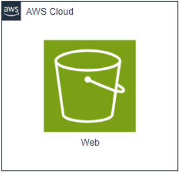

# Criação de um S3 na AWS e Configuração para Site Estático




## Pré-requisitos

### Ferramentas Necessárias

1. **AWS CLI**: Instalada e configurada com as credenciais (Access Key e Secret Key) do usuário.
2. **Terraform**: Instalada para gerenciar a infraestrutura como código.

## Configuração da AWS CLI
Execute o comando abaixo para configurar a AWS CLI com suas credenciais:

```
aws configure
```

Siga as instruções e forneça os parâmetros solicitados (Access Key, Secret Key, região e formato de saída).

## Passos para Configuração do S3 e Site Estático

### 1. Iniciar o Terraform
No diretório onde o código Terraform está localizado, execute:

```
terraform init
```

Este comando inicializa o Terraform, baixando os plugins necessários.

### 2. Verificar o Plano de Execução
Para ver o que o Terraform irá criar, execute:

```
terraform plan
```

Este comando mostra uma prévia das ações que serão executadas.

### 3. Aplicar as Configurações
Para criar os recursos na AWS, execute:

```
terraform apply -auto-approve
```

O parâmetro *-auto-approve* é opcional e serve para aprovar automaticamente as alterações. Caso não utilize este parâmetro, você precisará aprovar manualmente.

### 4. Verificar o Site Criado
Abra o navegador de sua preferência e digite o seguinte URL para acessar o site estático:

```
http://bucket-name-terraform-site.s3-website-sa-east-1.amazonaws.com
```

Substitua bucket-name-terraform-site pelo nome do seu bucket.

## Exclusão dos Recursos Criados
Para remover todos os recursos criados pelo Terraform, execute:

```
terraform destroy
```

Este comando destruirá todos os recursos provisionados.
